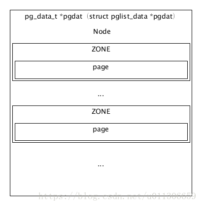

## 综述：

　　kernel image在被bootloader或者UEFI加载后，最终会跳到kernel的入口代码处，顺便将一些参数传给内核。kernel的启动包括两个阶段，分别由两个head.S描述。第一个阶段是内核的解压缩和重定位，第二阶段从stext开始，主要完成的工作有：参数检查，创建初始化页表，设置C代码运行环境，为跳转到内核第一个真正的C函数start_kernel做准备。所以，第二阶段这里包含了一次页表的创建，创建页表的入口是"__create_page_tables"。后面从c函数start_kernel开始，内核在start_kernel()->setup_arch()中通过arm64_memblock_init( )完成了memblock的初始化, 接着通过setup_arch()->paging_init()初始化分页机制。paging_init()是二次页表创建的接口，这个函数执行完，内核便布局了一套可供内核和进程安全运行的完整的虚拟内存空间。

_ _ _

　　另外，在paging_init的最后调用了bootmem_init，用以对内存基本数据结构(内存结点pg_data_t，内存域zone和页帧)做初始化工作，最后，内核将内存管理的工作从早期的内存分配器(bootmem或者memblock)移交到我们的内存管理器——buddy伙伴系统。

## （1）内存基本数据结构：

　　pg_data_t *pgdat是描述node的数据结构，UMA结构只有一个node。pg_data_t *pgda等价于struct pglist_data *pgdat。一个node又包含多个内存管理区域，如ZONE_NORMAL，ZONE_DMA等：

## （2）create_page_table完成了3种地址映射的页表空间填写：

identity mapping

kernel image mapping

fdt mapping（fix mapping）

## 那么初期创建的这三种页表的作用是什么呢？

　　在开启MMU之前做这样的映射，是为了enable_mmu附近的那段代码正确执行，MMU开启之后，程序将在虚拟地址上运行，如同链接地址和运行地址不一致时代码不能正常运行，程序在虚拟地址上运行时也要能找到其所映射到的物理地址，因此要建立这样的映射表。另外，初期创建的页表虽然会在二次创建页表时被覆盖，但也是paging_init->map_mem中二次创建页表的基础和依赖。

　　未完待续。。。
