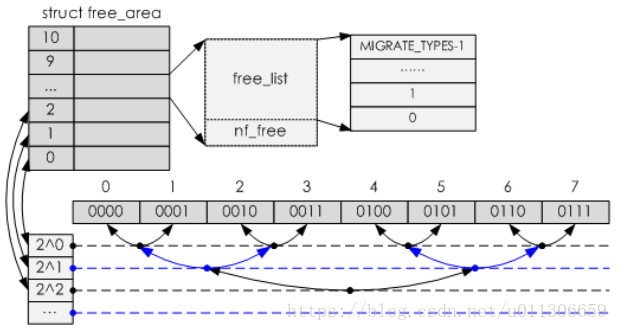

&emsp;&emsp;内存管理有两个算法：伙伴算法和slab/slub算法。伙伴算法是以页为单位管理内存，slab算法是以字节为单位管理内存，是内核的小内存管理算法。slab分配器并没有脱离伙伴系统，而是基于伙伴系统分配的大内存进一步细分成小内存。先讲伙伴系统，再讲slab分配器。

&emsp;&emsp;伙伴系统是基于bootmem机制来分配一些数据结构的。bootmem初始化的时候会调用free_area_init_node来对内存域zone数据结构进行初始化。zone包含一个frea_area的结构体来描述本ZONE的空闲页块链表，也会在bootmem初始化zone时被一并初始化。

		struct zone {
     ...
    /* free areas of different sizes */
    struct free_area    free_area[MAX_ORDER];

     ...
     } ____cacheline_internodealigned_in_smp;

&emsp;&emsp;注意struct free_area free_area[MAX_ORDER]是一个以链表为元素的数组，数组的每个元素都是某个阶数的空闲内存块的链表。

&emsp;&emsp;MAX_ORDER（最大阶数）一般默认为11，代表有11个free_area，即有11组空闲页块的链表。

例如free_area[0]：是一个链表，该链表里是长度为1的页块。即这个链表里有若干内存块，每个内存块都是1个page。

free_area[10]：也是一个链表，该链表里是长度为1024的页块。即这个链表里有若干内存块，每个内存块都是1024个page（4M内存空间）。

free_area的下标与该元素的链表中的内存块大小存在2的阶的关系。

 

&emsp;&emsp;那么什么是伙伴呢？如果同一个链表中的两个页块满足下面这三个条件，我们就称这两个页块为伙伴：

&emsp;&emsp;1)  两个块的大小相同，假设为b。

&emsp;&emsp;2)  两个块的物理地址连续。

&emsp;&emsp;3) 伙伴中第一个块的起始物理地址是2*b*PAGE_SIZE的整数倍。即第0块和第1块是伙伴，第2块和第3块是伙伴，但是第1块和第2块不是伙伴。这样规定的目的是确保一对伙伴中的两个块可以合并成更高一级的大块。

&emsp;&emsp;伙伴的关系有三种，（1）一个被分配时，那么另一个就等着这个分配出去的块被释放后合并，然后递归的进行更大order的合并；（2）如果两个都被分配，那么肯定有一个先被释放，那么化为情况一，注意在等待伙伴被释放的同时，该块可以被分配，从而情况一化为情况二，但是最终它们结果总是趋向于情况三，也就是都被释放从而被合并然后插入到更大一层的链表中。——有效防止内存碎片的产生。

&emsp;&emsp;如果链表的阶数为n，页块1的页号为page_id，其伙伴的页号查找公式为：

		buddy_id = page_id ^ (1 << n)

&emsp;&emsp;伙伴系统申请内核内存的接口有：alloc_pages，_ _get_free_pages等。

&emsp;&emsp;slub分配的原理可参考如下文章：https://blog.csdn.net/lukuen/article/details/6935068

&emsp;&emsp;我们在驱动开发的时候经常用到kmalloc函数，它就是基于slab分配器实现的。例如，我们分配一个17Bytes的内存，会这样调用：kmalloc(17, GFP_KERNEL)，系统会从名称“kmalloc-32”管理的slab缓存池中分配一个对象，即使浪费了剩余的15Byte。
